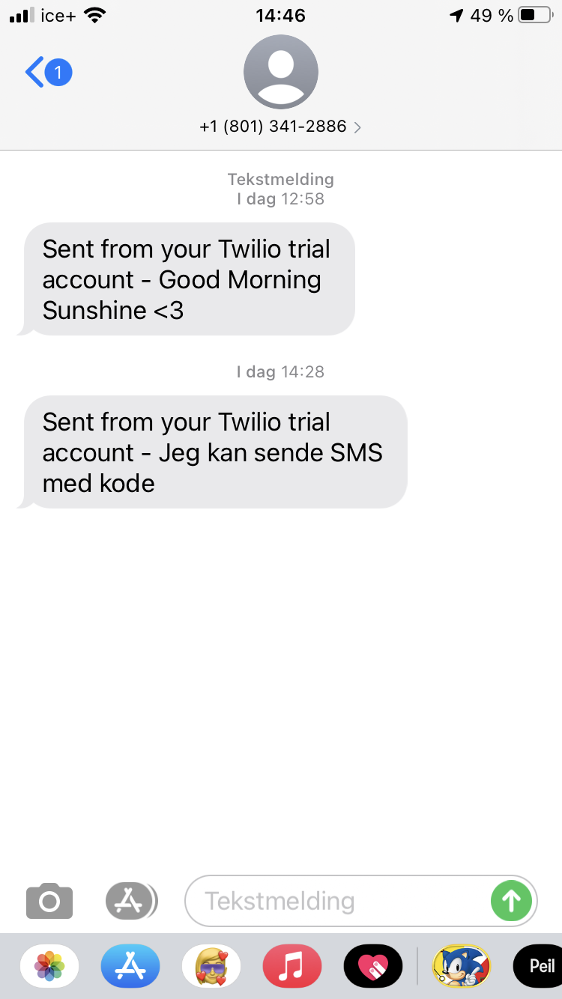

# Automatic SMS
#### **Note:** You will be need a API-key to be able to run, or request it from me. As it can not be published on GitHub (The Key will be deactivated if it's uploaded).

This is a small project that explores the possibility of sending SMS to Norwegian mobile numbers. The thought behind this is that this can be used to send SMS even though they might not be awake themselves. Like a Good Morning to their significant other or birthday congratulations. 


#### To be able to run:

You will need to install Twilio: 

```bash
pip install twilio 
```

or

```bash
pip3 install twilio
```

<br><br>

Then to execute the code, type:

```bash
python3 automatic-sms.py
```

